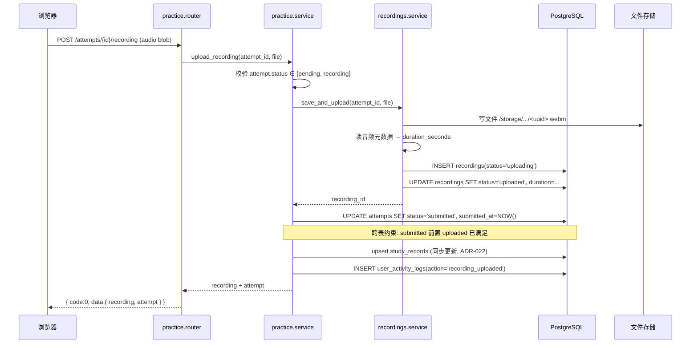
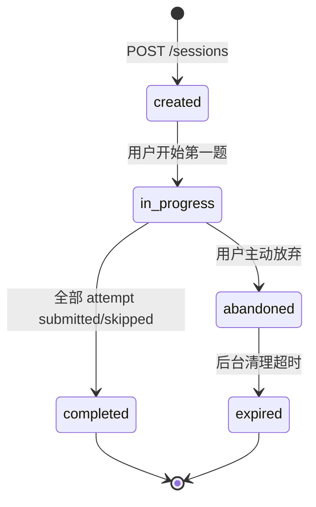
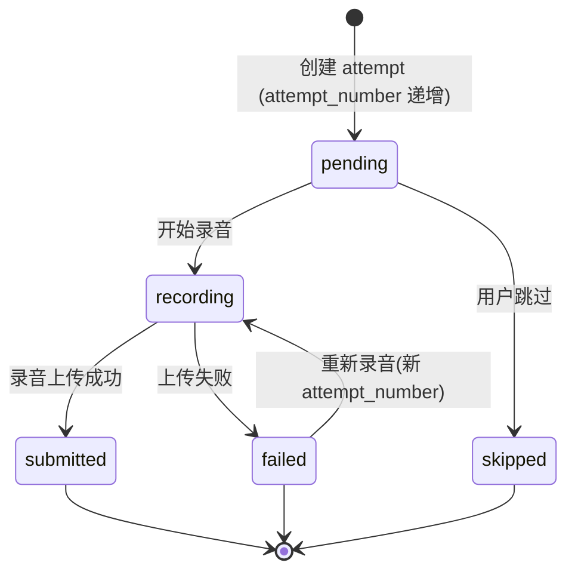
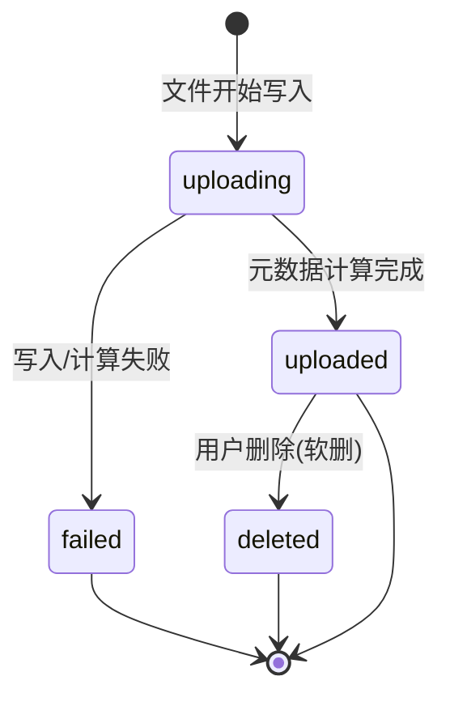

# IELTS Speaking Web App — 系统架构文档

> 本文定义系统如何组织与运行：部署拓扑、请求链路、分层职责、核心业务流程。
> **不重复讨论表结构**——数据模型以 [database-design.md](file:///workspace/docs/database/database-design.md) v0.3 为准。
> 对应规格：`PROJECT_SPEC.md` v0.4。

---

## 0. 文档定位

本文回答：

```text
用户请求如何进入系统？
模块如何组织？
核心业务（录音上传 / 练习生命周期 / 统计重算）如何在系统中流动？
```

不回答：

```text
表有哪些字段？      → database-design.md
API 字段是什么？    → docs/api/（待建）
产品要做哪些功能？  → PROJECT_SPEC.md
```

---

## 1. 系统全景

### 1.1 部署拓扑

```text
                 Internet
                    │
                    ▼
                  Nginx
              ┌─────┴─────┐
              ▼           ▼
          user-web     admin-web          (静态资源 / SPA)
              │           │
              └─────┬─────┘
                    ▼
                FastAPI (backend)
                    │
        ┌───────────┼───────────┐
        ▼           ▼           ▼
    PostgreSQL   本地FS/MinIO   (未来: Redis)
```

### 1.2 服务清单（Docker Compose）

| 服务 | 镜像/构建 | 端口 | 职责 |
| --- | --- | --- | --- |
| `nginx` | nginx:alpine | 80/443 | 反向代理 + SPA 静态资源 + HTTPS 终止 |
| `user-web` | node 构建→静态文件 | (内部) | 用户端 SPA |
| `admin-web` | node 构建→静态文件 | (内部) | 管理后台 SPA |
| `backend` | python:3.11-slim | 8000(内部) | FastAPI 应用 |
| `postgres` | postgres:16 | 5432(内部) | 数据库 |

> MVP 不含 `redis` / `minio` 容器；开发用本地 FS，生产再引入 MinIO 容器。

### 1.3 网络与端口策略

- 仅 `nginx` 暴露 80/443 给外网。
- `backend` / `postgres` 仅在 Docker 内部网络可达。
- `user-web` / `admin-web` 构建为静态文件，由 nginx 直接托管，无运行时容器（或用轻量 nginx 托管）。

---

## 2. 请求链路

### 2.1 用户端 API 请求

```text
浏览器(user-web)
    │  GET /api/v1/questions  (Authorization: Bearer <jwt>)
    ▼
Nginx  ── location /api/ ──▶  backend:8000
    │
    ▼
FastAPI main.py (路由聚合)
    │
    ▼
modules/questions/router.py     # 入参校验、依赖注入(当前用户)
    │
    ▼
modules/questions/service.py    # 业务逻辑、事务边界
    │
    ▼
modules/questions/repository.py # SQLAlchemy 查询
    │
    ▼
PostgreSQL
    │
    ▼
统一响应 { code, message, data } ──▶ Nginx ──▶ 浏览器
```

### 2.2 管理端 API 请求

链路同上，区别：

- 路由前缀 `/api/v1/admin/*`。
- 依赖注入增加 `require_admin`（校验 `role='admin'`）。
- 走 `modules/admin/` 而非业务模块 router。

### 2.3 静态资源请求

```text
浏览器 ──GET /──▶ Nginx
                    │
                    ├── /api/* ──▶ backend
                    ├── /admin/* ──▶ admin-web 静态文件 (try_files → index.html)
                    └── /* ──▶ user-web 静态文件 (try_files → index.html)
```

### 2.4 录音文件请求

```text
上传：POST /api/v1/practice/attempts/{id}/recording
         ──▶ backend ──▶ 本地 FS /storage/recordings/<yyyy>/<mm>/<uuid>.webm
下载：GET  /api/v1/practice/attempts/{id}/recording
         ──▶ backend ──▶ 读文件 ──▶ StreamingResponse
```

> MVP 录音经 backend 中转（非直传存储），便于鉴权与元数据计算。未来大文件可改预签名 URL 直传 MinIO。

---

## 3. 后端架构

### 3.1 分层模型

```text
Router (router.py)
  - Pydantic 入参校验
  - 依赖注入（当前用户、DB Session）
  - 调用 service
  - 包装统一响应
  - 不直接操作 DB
     │
     ▼
Service (service.py)
  - 业务逻辑、状态机转换
  - 事务边界（@transactional）
  - 跨 repository 编排
  - 跨表约束校验（如 ADR-015）
  - 不含 SQL 细节
     │
     ▼
Repository (repository.py)
  - SQLAlchemy 查询封装
  - 单表或单聚合根操作
  - 不含业务规则
     │
     ▼
Models (core/models.py)
  - SQLAlchemy 2.x ORM (Mapped / mapped_column)
     │
     ▼
PostgreSQL
```

### 3.2 领域模块

```text
modules/
├── auth/          注册/登录/退出/JWT 签发
├── users/         资料/密码/目标(user_goals)
├── questions/     题库/主题/标签/收藏(用户端读)
├── practice/      会话/会话题目/答题/完成
├── recordings/    录音上传/读取/元数据计算
├── learning/      统计聚合(读 study_records + 事实表重算)
├── home/          首页聚合 + 规则推荐
└── admin/         后台管理(用户/主题/标签/题目 CRUD)
```

**跨模块调用规则：**
- service 可调用其他模块的 service（如 `practice.service` 调 `recordings.service`）。
- service **不可**直接调用其他模块的 repository（必须经对方 service）。
- repository 不可跨模块。
- 跨表状态约束（ADR-015）在 `practice.service` 统一校验。

### 3.3 core 层

```text
core/
├── config.py       # Pydantic Settings，读环境变量
├── database.py     # engine / SessionLocal / get_db 依赖
├── security.py     # JWT 编解码 / bcrypt / 密码校验
├── exceptions.py   # 业务异常基类 + 错误码
├── response.py     # 统一响应包装 { code, message, data }
└── models.py       # SQLAlchemy Base + 共混 TimestampMixin
```

### 3.4 依赖注入

```text
get_db()                    # → Session（请求级）
get_current_user()          # → User（解析 JWT，校验 active）
require_admin()             # → User（叠加 role='admin' 校验）
```

---

## 4. 前端架构

### 4.1 user-web

```text
src/
├── api/            # axios 封装，按模块分文件
├── stores/         # Pinia: auth / user / practice
├── router/         # 路由守卫（未登录跳 /login）
├── views/
│   ├── home/
│   ├── questions/
│   ├── practice/   # 含 PracticePage 状态机
│   ├── learning/
│   └── profile/
├── components/
└── composables/    # useRecorder (录音状态机)
```

- UI：Tailwind CSS 为主，复杂表单用 Element Plus。
- 图表：ECharts（learning 模块）。
- 录音：`useRecorder` composable 封装 MediaRecorder + 状态机。

### 4.2 admin-web

```text
src/
├── api/
├── stores/
├── router/         # 守卫校验 admin 角色
├── views/
│   ├── dashboard/
│   ├── users/
│   ├── topics/
│   ├── tags/
│   └── questions/  # 含编辑页 + source_type/source_name 必填
└── components/
```

- UI：Element Plus 为主。

### 4.3 共享 packages

```text
packages/
├── types/          # 共享 TS 类型（Question / Session / Attempt / Recording）
├── api-client/     # axios 实例 + 拦截器（token 注入、统一错误处理）
├── ui/             # 跨端复用组件（如音频播放器）
└── utils/          # 时间格式化、duration 格式化等
```

---

## 5. 核心业务流程

### 5.1 录音上传流程（核心，序列图）

> 严格遵循 ADR-015：`attempt.submitted ⇒ recording.uploaded`。
> 顺序：**先上传成功，再标 submitted**，禁止反过来。



**事务边界**：`recordings.uploaded` → `attempt.submitted` → `study_records` 在**同一事务**内（ADR-022 同步更新）。任一失败全回滚，attempt 退回 `recording`，recording 标 `failed`。

### 5.2 练习会话生命周期



**完成前置约束（ADR-015）**：`completed` 要求该 session 所有 `session_question` 至少有一个 `submitted` 或 `skipped` 的 attempt，由 `practice.service` 校验。

### 5.3 Attempt 生命周期



**关键约束**：`submitted` 仅在 `recording.uploaded` 后由 service 设置，前端不可直接置 `submitted`。

### 5.4 Recording 生命周期



### 5.5 统计重算流程

> `study_records` 是可重算聚合（ADR-008），非事实来源。

```text
触发: 内部脚本 / 接口 (管理员或定时任务)
   │
   ▼
learning.service.recalculate(user_id, date)
   │
   ├── 查事实表: 当日 uploaded recordings (按 timezone 切日, ADR-018)
   ├── 查事实表: 当日 sessions / attempts
   │
   ▼
按口径计算 (ADR-016):
   duration_seconds = SUM(recording.duration_seconds WHERE status='uploaded')
   recording_count  = COUNT(...)
   practice_count   = COUNT(sessions)
   ...
   │
   ▼
UPSERT study_records(user_id, record_date)
   │
   ▼
覆盖完成
```

**抽象边界**：`learning.service` 对外提供 `record_event(event)` 与 `recalculate(user, date)` 两个接口。MVP `record_event` 同步调用；未来切消息队列只改实现不改调用方。

### 5.6 推荐流程（首页）

> 确定性规则（ADR-012），无随机数，可复现。

```text
home.service.get_overview(user_id)
   │
   ├── 1. 查未完成 session (status ∈ {created, in_progress})
   │      命中 → 返回"继续练习"
   │
   ├── 2. 查最近练习主题
   │      命中 → 返回该主题 published 题目
   │
   ├── 3. 查收藏未练习题目
   │      命中 → 返回收藏题目
   │
   ├── 4. 查用户较少练习的 Part
   │      命中 → 返回该 Part 题目
   │
   └── 5. 默认: 热门题目 (按练习次数排序)
```

每级取前 N（前端定，建议 5），短路返回。

---

## 6. 数据流与一致性

### 6.1 事实表 → 聚合表

```text
事实数据(不可变真相)            聚合(可重算)
┌─────────────────────┐      ┌──────────────┐
│ practice_sessions   │      │              │
│ practice_attempts   │ ───▶ │ study_records │ ───▶ Dashboard
│ recordings          │ 统计  │              │
│ user_activity_logs  │ 服务  └──────────────┘
└─────────────────────┘
```

- Dashboard 读 `study_records`，不直接聚合事实表（性能）。
- 统计异常时从事实表重算覆盖 `study_records`（ADR-008）。

### 6.2 快照不可变

```text
speaking_questions (题库当前版本, 可改)
        │
        │ 创建 session 时拷贝
        ▼
practice_session_questions.question_snapshot (不可变快照)
        │
        ▼
历史练习永远显示作答当时的题目
```

> 题库后续修改/禁用不影响历史会话展示。快照必含字段见 PROJECT_SPEC §4.5.5。

### 6.3 跨表状态约束（ADR-015）

DB CHECK 无法跨表，由 `practice.service` 在事务内校验：

| 约束 | 校验点 |
| --- | --- |
| `attempt.submitted` ⇒ `recording.uploaded` | 录音上传事务内，先标 recording 再标 attempt |
| `session.completed` ⇒ 全部 sq 有 submitted/skipped | 完成会话接口，service 遍历校验 |

违反则抛业务异常，事务回滚。

---

## 7. 文件存储架构

### 7.1 开发环境（本地 FS）

```text
/storage/recordings/<yyyy>/<mm>/<uuid>.<ext>
```

- `recordings.storage_type='local'`，`storage_path` 存相对路径。
- backend 容器挂载 `/storage` 卷。

### 7.2 生产环境（MinIO，S3 兼容）

```text
bucket: ielts-recordings
key:    recordings/<yyyy>/<mm>/<uuid>.<ext>
```

- `recordings.storage_type='s3'`，`storage_path` 存 object key。
- 通过预签名 URL 上传/下载（未来优化）。

### 7.3 抽象接口

```text
recordings.service
  ├── save(file) → storage_path
  ├── read(storage_path) → stream
  └── delete(storage_path)
```

底层由 `LocalStorageBackend` / `S3StorageBackend` 实现，配置切换，业务无感。

---

## 8. 安全架构

### 8.1 认证

- JWT Bearer Token（access_token）。
- 签发：`auth.service.login` 校验 bcrypt 后签发。
- 校验：`get_current_user` 依赖解析 JWT，查 `users` 校验 `status='active' AND deleted_at IS NULL`。
- MVP 不做 refresh_token（后续加）。

### 8.2 授权

- 角色级（ADR-009）：`user` / `admin`。
- `require_admin` 依赖叠加角色校验。
- 资源所有权：`practice.service` 校验 `session.user_id == current_user.id`，越权返回 403。

### 8.3 密码

- bcrypt（PROJECT_SPEC §6.1）。
- 注册/改密时 `security.hash_password`。
- 登录时 `security.verify_password`。

### 8.4 CORS

- 开发：允许 `localhost:5173` / `localhost:5174`。
- 生产：仅允许 nginx 域名。

### 8.5 输入校验

- Pydantic 2.x 在 router 层校验。
- 文件上传：校验 mime_type 白名单 + 大小限制。

---

## 9. 部署架构

### 9.1 Docker Compose 编排

```text
docker-compose.yml
├── nginx        (暴露 80/443)
├── backend      (依赖 postgres)
├── postgres     (数据卷持久化)
└── (构建阶段) user-web-build / admin-web-build → 产物挂载到 nginx
```

### 9.2 启动顺序

```text
postgres → backend (等 pg healthy) → nginx
```

backend 启动时：
1. 等待 pg 就绪。
2. 运行 `alembic upgrade head`（迁移）。
3. 运行 `scripts/seed_admin.py`（幂等种子）。
4. 启动 uvicorn。

### 9.3 环境变量（关键）

| 变量 | 用途 |
| --- | --- |
| `DATABASE_URL` | PostgreSQL 连接串 |
| `JWT_SECRET` | JWT 签名密钥 |
| `ADMIN_EMAIL` / `ADMIN_PASSWORD` | 初始管理员（seed 脚本） |
| `STORAGE_TYPE` | `local` / `s3` |
| `STORAGE_LOCAL_PATH` | 本地存储根目录 |
| `CORS_ORIGINS` | 允许的前端来源 |

> 完整变量表在阶段 12 部署文档补充。

---

## 10. ADR 索引

> 决策正文待建 `docs/architecture/decisions/ADR-00x-*.md`。速查见 [AI_CONTEXT.md](file:///workspace/AI_CONTEXT.md) §7。

| ADR | 决策 | 本文引用 |
| --- | --- | --- |
| ADR-001 | Monorepo | §1.2 |
| ADR-002 | 两个前端应用 | §4 |
| ADR-003 | 领域模块 | §3.2 |
| ADR-004 | PostgreSQL | §1.2 |
| ADR-005 | BIGINT Identity | database-design §1.2 |
| ADR-006 | Attempt 模型 | §5.3 |
| ADR-007 | Recording 绑定 Attempt | §5.1 |
| ADR-008 | StudyRecord 可重算 | §5.5 / §6.1 |
| ADR-009 | 角色权限 | §8.2 |
| ADR-010 | 题目软停用 | database-design §3.2.3 |
| ADR-011 | source 必填 | database-design §3.2.3 |
| ADR-012 | 确定性推荐 | §5.6 |
| ADR-013 | BIGINT GENERATED ALWAYS | database-design §1.2 |
| ADR-014 | active goal 部分唯一 | database-design §4.1 |
| ADR-015 | 跨表状态约束 | §5.1 / §6.3 |
| ADR-016 | duration 口径 | §5.5 / database-design §3.4.1 |
| ADR-017 | 关联表复合主键 | database-design §3.2.4 |
| ADR-018 | timezone 切日 | §5.5 / database-design §3.4.1 |
| ADR-019 | topic_id NOT NULL | database-design §3.2.3 |
| ADR-020 | duration 后端计算 | §5.1 / database-design §3.3.4 |
| ADR-021 | mime 不转码 | database-design §3.3.4 |
| ADR-022 | study_records 同步预留异步 | §5.1 / §5.5 |
| ADR-023 | activity log 180 天 | database-design §3.4.2 |

---

## 11. 与下游文档的衔接

| 下游文档 | 本文提供的基础 |
| --- | --- |
| `docs/api/` | 模块划分（§3.2）、请求链路（§2）、统一响应、录音上传流程（§5.1） |
| `docs/product/user-flow.md` | 状态机（§5.2/5.3/5.4）、推荐流程（§5.6） |
| `docs/development-plan.md` | 模块依赖顺序（§3.2）、阶段划分对齐 PROJECT_SPEC §14 |

---

## 变更记录

| 版本 | 日期 | 变更 |
| --- | --- | --- |
| v0.1 | 2026-07-23 | 初始创建：部署拓扑 + 请求链路 + 后端/前端分层 + 6 个核心业务流程（Mermaid）+ 数据流 + 存储/安全/部署 + ADR 索引 |
