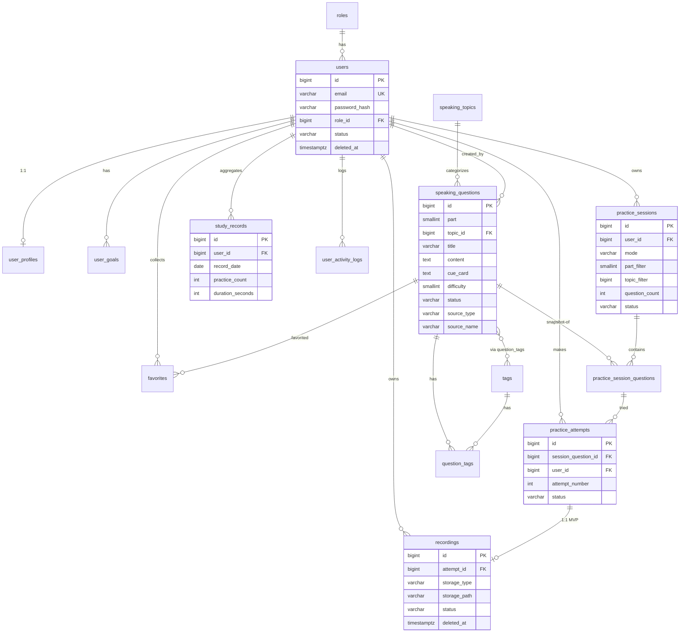

# IELTS Speaking Web App — 数据库设计文档

> 本文是 MVP 数据库的**工程级设计文档**，是 Alembic 迁移与 SQLAlchemy 模型的唯一来源。
> 任何表/字段/约束/索引变更必须先更新本文档，再生成迁移。
> 对应规格：`PROJECT_SPEC.md` v0.2 §4 / §7 / §8。

---

## 0. 文档结构

1. 设计原则与规范
2. 枚举设计
3. 完整 DDL（按域分组）
4. 索引策略汇总
5. 约束清单汇总
6. ER 图（Mermaid）
7. 软删除策略
8. Alembic 迁移顺序
9. 初始数据与管理员账号
10. 与 PROJECT_SPEC 映射

---

## 1. 设计原则与规范

### 1.1 命名规范

| 对象 | 规范 | 示例 |
| --- | --- | --- |
| 表名 | 复数蛇形，全小写 | `practice_sessions` |
| 字段名 | 蛇形，全小写 | `created_at` |
| 主键 | `id`，`BIGINT GENERATED ALWAYS AS IDENTITY` | — |
| 外键 | `<目标表单数>_id` | `user_id`、`session_id`、`attempt_id` |
| 索引 | `ix_<表>_<字段>` 或 `ix_<表>_<字段1>_<字段2>` | `ix_practice_sessions_user_id` |
| 唯一约束 | `uq_<表>_<字段>` | `uq_users_email` |
| CHECK 约束 | `ck_<表>_<含义>` | `ck_speaking_questions_part` |
| 外键约束 | `fk_<表>_<目标表>` | `fk_users_roles` |

### 1.2 类型规范

| 用途 | PostgreSQL 类型 | 说明 |
| --- | --- | --- |
| 主键 | `BIGINT GENERATED ALWAYS AS IDENTITY` | ADR-005：BIGINT，SQL 标准自增，优于 BIGSERIAL |
| 外键 | `BIGINT` | 与主键一致 |
| 短文本 | `VARCHAR(n)` | 显式长度 |
| 长文本 | `TEXT` | 题目内容、备注 |
| 状态/枚举 | `VARCHAR(n)` + `CHECK` | 见 §2，不用 PG ENUM 类型 |
| 金额/分数 | `NUMERIC(p,s)` | 精确小数 |
| 计数 | `INTEGER` | — |
| 排序 | `INTEGER` | sort_order |
| 时间戳 | `TIMESTAMP WITH TIME ZONE` (TIMESTAMPTZ) | UTC 存储 |
| 日期 | `DATE` | study_records.record_date |
| 布尔 | `BOOLEAN` | — |
| JSON 快照 | `JSONB` | 题目快照、日志 metadata |
| IP | `INET` | 活动日志 |

### 1.3 通用字段

所有业务表包含：

```sql
created_at TIMESTAMPTZ NOT NULL DEFAULT NOW(),
updated_at TIMESTAMPTZ NOT NULL DEFAULT NOW()
```

软删除表额外包含：

```sql
deleted_at TIMESTAMPTZ NULL
```

`updated_at` 通过触发器自动更新（见 §8.3）。

### 1.4 为什么用 VARCHAR + CHECK 而非 PostgreSQL ENUM 类型

- PG ENUM 增删值需 `ALTER TYPE`，删值/改名在 PG 12 前不支持，迁移痛苦。
- VARCHAR + CHECK 在 Alembic 中改值只需改约束，符合 MVP 状态值迭代可能。
- SQLAlchemy 2.x 用 `mapped_column(String(20))` + `CheckConstraint` 更自然。
- 查询计划与索引行为上两者基本等价。

枚举值集合在 §2 固定，应用层（Pydantic `Literal` / `Enum`）二次校验。

### 1.5 外键删除策略

| 场景 | 策略 | 理由 |
| --- | --- | --- |
| 字典表被引用（roles/topics/tags） | `ON DELETE RESTRICT` | 防误删，应先清理引用 |
| 业务事实表被引用（sessions/questions/attempts） | `ON DELETE RESTRICT` | 事实数据不可因外键级联丢失 |
| 1:1 从属表（user_profiles → users） | `ON DELETE CASCADE` | profile 随用户物理删除而消失（用户实际走软删，极少触发） |
| 纯关联表（question_tags / favorites） | `ON DELETE CASCADE` | 关联表随主体消失 |
| session_questions → sessions | `ON DELETE CASCADE` | 会话删除时其题目快照随之删除 |
| attempts → session_questions | `ON DELETE CASCADE` | 同上 |
| recordings → attempts | `ON DELETE RESTRICT` | 录音元数据保留审计，物理删除走软删 |

> 用户、题目均为软删除，物理外键级联只在确实需要时生效；ON DELETE 仅兜底物理删除场景。

---

## 2. 枚举设计（VARCHAR + CHECK 值集）

| 表.字段 | 合法值 | 默认 |
| --- | --- | --- |
| `roles.name` | `user`, `admin` | — |
| `users.status` | `active`, `disabled` | `active` |
| `user_goals.status` | `active`, `achieved`, `archived` | `active` |
| `speaking_questions.part` | `1`, `2`, `3` (SMALLINT) | — |
| `speaking_questions.status` | `draft`, `published`, `disabled` | `draft` |
| `speaking_questions.source_type` | `official`, `historical`, `mock`, `custom` | `custom` |
| `practice_sessions.mode` | `random`, `topic`, `part` | — |
| `practice_sessions.status` | `created`, `in_progress`, `completed`, `abandoned`, `expired` | `created` |
| `practice_attempts.status` | `pending`, `recording`, `submitted`, `skipped`, `failed` | `pending` |
| `recordings.status` | `uploading`, `uploaded`, `failed`, `deleted` | `uploading` |
| `recordings.storage_type` | `local`, `s3` | `local` |

---

## 3. 完整 DDL

### 3.1 用户域

#### 3.1.1 `roles`

```sql
CREATE TABLE roles (
    id           BIGINT GENERATED ALWAYS AS IDENTITY PRIMARY KEY,
    name         VARCHAR(50)  NOT NULL,
    description  VARCHAR(200),
    created_at   TIMESTAMPTZ  NOT NULL DEFAULT NOW(),
    updated_at   TIMESTAMPTZ  NOT NULL DEFAULT NOW(),
    CONSTRAINT uq_roles_name UNIQUE (name)
);
```

#### 3.1.2 `users`

```sql
CREATE TABLE users (
    id                BIGINT GENERATED ALWAYS AS IDENTITY PRIMARY KEY,
    email             VARCHAR(255) NOT NULL,
    password_hash     VARCHAR(255) NOT NULL,
    role_id           BIGINT       NOT NULL,
    status            VARCHAR(20)  NOT NULL DEFAULT 'active',
    email_verified_at TIMESTAMPTZ,
    last_login_at     TIMESTAMPTZ,
    deleted_at        TIMESTAMPTZ,
    created_at        TIMESTAMPTZ  NOT NULL DEFAULT NOW(),
    updated_at        TIMESTAMPTZ  NOT NULL DEFAULT NOW(),
    CONSTRAINT uq_users_email UNIQUE (email),
    CONSTRAINT fk_users_roles FOREIGN KEY (role_id) REFERENCES roles(id) ON DELETE RESTRICT,
    CONSTRAINT ck_users_status CHECK (status IN ('active', 'disabled'))
);
```

> 软删除：`deleted_at`。查询时应用层过滤 `deleted_at IS NULL`，邮箱唯一约束需配合（见 §7.2 软删除与唯一约束）。

#### 3.1.3 `user_profiles`

```sql
CREATE TABLE user_profiles (
    id          BIGINT GENERATED ALWAYS AS IDENTITY PRIMARY KEY,
    user_id     BIGINT       NOT NULL,
    nickname    VARCHAR(100),
    avatar_url  VARCHAR(500),
    bio         TEXT,
    timezone    VARCHAR(50)  NOT NULL DEFAULT 'Asia/Shanghai',
    created_at  TIMESTAMPTZ  NOT NULL DEFAULT NOW(),
    updated_at  TIMESTAMPTZ  NOT NULL DEFAULT NOW(),
    CONSTRAINT uq_user_profiles_user_id UNIQUE (user_id),
    CONSTRAINT fk_user_profiles_users FOREIGN KEY (user_id) REFERENCES users(id) ON DELETE CASCADE
);
```

#### 3.1.4 `user_goals`

```sql
CREATE TABLE user_goals (
    id                    BIGINT GENERATED ALWAYS AS IDENTITY PRIMARY KEY,
    user_id               BIGINT       NOT NULL,
    target_score          NUMERIC(3,1),
    current_level         VARCHAR(20),
    exam_date             DATE,
    daily_goal_minutes    INTEGER,
    weekly_goal_minutes   INTEGER,
    status                VARCHAR(20)  NOT NULL DEFAULT 'active',
    deleted_at            TIMESTAMPTZ,
    created_at            TIMESTAMPTZ  NOT NULL DEFAULT NOW(),
    updated_at            TIMESTAMPTZ  NOT NULL DEFAULT NOW(),
    CONSTRAINT fk_user_goals_users FOREIGN KEY (user_id) REFERENCES users(id) ON DELETE RESTRICT,
    CONSTRAINT ck_user_goals_status CHECK (status IN ('active', 'achieved', 'archived')),
    CONSTRAINT ck_user_goals_score CHECK (target_score IS NULL OR (target_score >= 0 AND target_score <= 9)),
    CONSTRAINT ck_user_goals_daily CHECK (daily_goal_minutes IS NULL OR daily_goal_minutes >= 0),
    CONSTRAINT ck_user_goals_weekly CHECK (weekly_goal_minutes IS NULL OR weekly_goal_minutes >= 0)
);
```

---

### 3.2 题库域

#### 3.2.1 `speaking_topics`

```sql
CREATE TABLE speaking_topics (
    id           BIGINT GENERATED ALWAYS AS IDENTITY PRIMARY KEY,
    name         VARCHAR(100) NOT NULL,
    description  TEXT,
    sort_order   INTEGER      NOT NULL DEFAULT 0,
    deleted_at   TIMESTAMPTZ,
    created_at   TIMESTAMPTZ  NOT NULL DEFAULT NOW(),
    updated_at   TIMESTAMPTZ  NOT NULL DEFAULT NOW(),
    CONSTRAINT uq_speaking_topics_name UNIQUE (name)
);
```

#### 3.2.2 `tags`

```sql
CREATE TABLE tags (
    id          BIGINT GENERATED ALWAYS AS IDENTITY PRIMARY KEY,
    name        VARCHAR(50) NOT NULL,
    deleted_at  TIMESTAMPTZ,
    created_at  TIMESTAMPTZ NOT NULL DEFAULT NOW(),
    updated_at  TIMESTAMPTZ NOT NULL DEFAULT NOW(),
    CONSTRAINT uq_tags_name UNIQUE (name)
);
```

#### 3.2.3 `speaking_questions`

```sql
CREATE TABLE speaking_questions (
    id            BIGINT GENERATED ALWAYS AS IDENTITY PRIMARY KEY,
    part          SMALLINT     NOT NULL,
    topic_id      BIGINT       NOT NULL,
    title         VARCHAR(255) NOT NULL,
    content       TEXT         NOT NULL,
    cue_card      TEXT,
    difficulty    SMALLINT,
    status        VARCHAR(20)  NOT NULL DEFAULT 'draft',
    source_type   VARCHAR(20)  NOT NULL DEFAULT 'custom',
    source_name   VARCHAR(255) NOT NULL,
    created_by    BIGINT,
    created_at    TIMESTAMPTZ  NOT NULL DEFAULT NOW(),
    updated_at    TIMESTAMPTZ  NOT NULL DEFAULT NOW(),
    CONSTRAINT fk_questions_topics FOREIGN KEY (topic_id) REFERENCES speaking_topics(id) ON DELETE RESTRICT,
    CONSTRAINT fk_questions_users FOREIGN KEY (created_by) REFERENCES users(id) ON DELETE SET NULL,
    CONSTRAINT ck_questions_part CHECK (part IN (1, 2, 3)),
    CONSTRAINT ck_questions_status CHECK (status IN ('draft', 'published', 'disabled')),
    CONSTRAINT ck_questions_source CHECK (source_type IN ('official', 'historical', 'mock', 'custom')),
    CONSTRAINT ck_questions_difficulty CHECK (difficulty IS NULL OR (difficulty >= 1 AND difficulty <= 5))
);
```

> 无 `deleted_at`：题目用 `status='disabled'` 软停用（ADR-010），保证历史会话引用完整性。
> `topic_id` `NOT NULL`：所有题目必须归属主题；无明确主题的归入种子主题 `Other`（见 §9.4），保证按主题练习/统计/推荐可行。

#### 3.2.4 `question_tags`

```sql
CREATE TABLE question_tags (
    question_id  BIGINT NOT NULL,
    tag_id       BIGINT NOT NULL,
    created_at   TIMESTAMPTZ NOT NULL DEFAULT NOW(),
    PRIMARY KEY (question_id, tag_id),
    CONSTRAINT fk_qt_questions FOREIGN KEY (question_id) REFERENCES speaking_questions(id) ON DELETE CASCADE,
    CONSTRAINT fk_qt_tags FOREIGN KEY (tag_id) REFERENCES tags(id) ON DELETE CASCADE
);
```

#### 3.2.5 `favorites`

```sql
CREATE TABLE favorites (
    id           BIGINT GENERATED ALWAYS AS IDENTITY PRIMARY KEY,
    user_id      BIGINT NOT NULL,
    question_id  BIGINT NOT NULL,
    created_at   TIMESTAMPTZ NOT NULL DEFAULT NOW(),
    CONSTRAINT uq_favorites_user_question UNIQUE (user_id, question_id),
    CONSTRAINT fk_favorites_users FOREIGN KEY (user_id) REFERENCES users(id) ON DELETE CASCADE,
    CONSTRAINT fk_favorites_questions FOREIGN KEY (question_id) REFERENCES speaking_questions(id) ON DELETE CASCADE
);
```

> 无 `status`：存在即收藏，删除即取消（PROJECT_SPEC §4.4）。`deleted_at` 无意义，故不设。

---

### 3.3 练习域（核心事实链）

#### 3.3.1 `practice_sessions`

```sql
CREATE TABLE practice_sessions (
    id                BIGINT GENERATED ALWAYS AS IDENTITY PRIMARY KEY,
    user_id           BIGINT      NOT NULL,
    mode              VARCHAR(20) NOT NULL,
    part_filter       SMALLINT,
    topic_filter      BIGINT,
    question_count    INTEGER     NOT NULL,
    status            VARCHAR(20) NOT NULL DEFAULT 'created',
    started_at        TIMESTAMPTZ,
    completed_at      TIMESTAMPTZ,
    duration_seconds  INTEGER,
    created_at        TIMESTAMPTZ NOT NULL DEFAULT NOW(),
    updated_at        TIMESTAMPTZ NOT NULL DEFAULT NOW(),
    CONSTRAINT fk_sessions_users FOREIGN KEY (user_id) REFERENCES users(id) ON DELETE RESTRICT,
    CONSTRAINT ck_sessions_mode CHECK (mode IN ('random', 'topic', 'part')),
    CONSTRAINT ck_sessions_status CHECK (status IN ('created', 'in_progress', 'completed', 'abandoned', 'expired')),
    CONSTRAINT ck_sessions_part_filter CHECK (part_filter IS NULL OR part_filter IN (1, 2, 3)),
    CONSTRAINT ck_sessions_count CHECK (question_count > 0 AND question_count <= 50)
);
```

#### 3.3.2 `practice_session_questions`

```sql
CREATE TABLE practice_session_questions (
    id                 BIGINT GENERATED ALWAYS AS IDENTITY PRIMARY KEY,
    session_id         BIGINT  NOT NULL,
    question_id        BIGINT  NOT NULL,
    question_snapshot  JSONB   NOT NULL,
    sort_order         INTEGER NOT NULL,
    created_at         TIMESTAMPTZ NOT NULL DEFAULT NOW(),
    CONSTRAINT uq_session_questions_order UNIQUE (session_id, sort_order),
    CONSTRAINT fk_sq_sessions FOREIGN KEY (session_id) REFERENCES practice_sessions(id) ON DELETE CASCADE,
    CONSTRAINT fk_sq_questions FOREIGN KEY (question_id) REFERENCES speaking_questions(id) ON DELETE RESTRICT
);
```

> `question_snapshot`：`JSONB`，题目被修改/禁用后，历史会话仍可还原作答时的题目内容（数据一致性原则 §7）。
> **必含字段**（PROJECT_SPEC §4.5.5）：`part`、`title`、`content`、`cue_card`、`topic_name`、`difficulty`。
> 应用层在创建 session_question 时从 `speaking_questions` 拷贝上述字段写入快照。

#### 3.3.3 `practice_attempts`

```sql
CREATE TABLE practice_attempts (
    id                  BIGINT GENERATED ALWAYS AS IDENTITY PRIMARY KEY,
    session_question_id BIGINT      NOT NULL,
    user_id             BIGINT      NOT NULL,
    attempt_number      INTEGER     NOT NULL,
    status              VARCHAR(20) NOT NULL DEFAULT 'pending',
    started_at          TIMESTAMPTZ,
    submitted_at        TIMESTAMPTZ,
    duration_seconds    INTEGER,
    note                TEXT,
    created_at          TIMESTAMPTZ NOT NULL DEFAULT NOW(),
    updated_at          TIMESTAMPTZ NOT NULL DEFAULT NOW(),
    CONSTRAINT uq_attempts_session_question_num UNIQUE (session_question_id, attempt_number),
    CONSTRAINT fk_attempts_sq FOREIGN KEY (session_question_id) REFERENCES practice_session_questions(id) ON DELETE CASCADE,
    CONSTRAINT fk_attempts_users FOREIGN KEY (user_id) REFERENCES users(id) ON DELETE RESTRICT,
    CONSTRAINT ck_attempts_status CHECK (status IN ('pending', 'recording', 'submitted', 'skipped', 'failed')),
    CONSTRAINT ck_attempts_duration CHECK (duration_seconds IS NULL OR duration_seconds >= 0)
);
```

> 同一 `session_question` 可有多个 attempt（支持重录），`attempt_number` 从 1 递增，语义为"该会话题目的第几次尝试"。
> 唯一约束 `(session_question_id, attempt_number)` 保证编号不重复；应用层在新建 attempt 时取 `MAX(attempt_number)+1`。

#### 3.3.4 `recordings`

```sql
CREATE TABLE recordings (
    id                BIGINT GENERATED ALWAYS AS IDENTITY PRIMARY KEY,
    attempt_id        BIGINT      NOT NULL,
    user_id           BIGINT      NOT NULL,
    storage_type      VARCHAR(20) NOT NULL DEFAULT 'local',
    storage_path      VARCHAR(500) NOT NULL,
    file_size         BIGINT,
    mime_type         VARCHAR(50) NOT NULL DEFAULT 'audio/webm',
    duration_seconds  INTEGER,
    status            VARCHAR(20) NOT NULL DEFAULT 'uploading',
    deleted_at        TIMESTAMPTZ,
    created_at        TIMESTAMPTZ NOT NULL DEFAULT NOW(),
    updated_at        TIMESTAMPTZ NOT NULL DEFAULT NOW(),
    CONSTRAINT uq_recordings_attempt UNIQUE (attempt_id),
    CONSTRAINT fk_recordings_attempts FOREIGN KEY (attempt_id) REFERENCES practice_attempts(id) ON DELETE RESTRICT,
    CONSTRAINT fk_recordings_users FOREIGN KEY (user_id) REFERENCES users(id) ON DELETE RESTRICT,
    CONSTRAINT ck_recordings_storage CHECK (storage_type IN ('local', 's3')),
    CONSTRAINT ck_recordings_status CHECK (status IN ('uploading', 'uploaded', 'failed', 'deleted')),
    CONSTRAINT ck_recordings_size CHECK (file_size IS NULL OR file_size >= 0),
    CONSTRAINT ck_recordings_duration CHECK (duration_seconds IS NULL OR duration_seconds >= 0)
);
```

> MVP `attempt_id` 唯一（一对一对一）。未来放开唯一约束即可支持一题多录音。
>
> **跨表状态约束（应用层 service 校验，DB 无法用 CHECK 表达）**：
> - `practice_attempts.status='submitted'` ⇒ 该 attempt 存在 `recordings.status='uploaded'` 的录音。
> - `practice_sessions.status='completed'` ⇒ 其所有 `session_question` 至少有一个 `submitted` 或 `skipped` 的 attempt。
> - 违反上述约束的更新由 `modules/practice/service.py` 拒绝并抛业务异常。
>
> **`duration_seconds` 计算规则**：由后端在文件落盘后读取音频元数据计算（不信前端传入）。前端 duration 仅作 UI 展示，统计以服务端计算值为准。
>
> **`mime_type` 转码策略**：MVP 不转码，直接存浏览器原始格式（`audio/webm` / `audio/mp4` 等）。后续若需 AI 评分或跨端播放兼容，再引入转码任务（非 MVP，不擅自增加 FFmpeg 依赖）。

---

### 3.4 用户行为与统计域

#### 3.4.1 `study_records`

```sql
CREATE TABLE study_records (
    id                BIGINT GENERATED ALWAYS AS IDENTITY PRIMARY KEY,
    user_id           BIGINT NOT NULL,
    record_date       DATE  NOT NULL,
    practice_count    INTEGER NOT NULL DEFAULT 0,
    question_count    INTEGER NOT NULL DEFAULT 0,
    attempt_count     INTEGER NOT NULL DEFAULT 0,
    duration_seconds  INTEGER NOT NULL DEFAULT 0,
    recording_count   INTEGER NOT NULL DEFAULT 0,
    created_at        TIMESTAMPTZ NOT NULL DEFAULT NOW(),
    updated_at        TIMESTAMPTZ NOT NULL DEFAULT NOW(),
    CONSTRAINT uq_study_records_user_date UNIQUE (user_id, record_date),
    CONSTRAINT fk_study_records_users FOREIGN KEY (user_id) REFERENCES users(id) ON DELETE RESTRICT,
    CONSTRAINT ck_study_counts CHECK (
        practice_count >= 0 AND question_count >= 0
        AND attempt_count >= 0 AND duration_seconds >= 0
        AND recording_count >= 0
    )
);
```

> 这是**每日聚合表，可重算覆盖**（ADR-008），非事实来源。事实来源为 sessions/attempts/recordings/activity_logs。
>
> **口径定义**（PROJECT_SPEC §4.5.4 / §9.2）：
> - `record_date`：按 `user_profiles.timezone` 切日（非 UTC 切日）。
> - `duration_seconds`：当日所有 `recordings.status='uploaded'` 的 `duration_seconds` 总和（非 session 时长）。
> - `recording_count`：当日 `uploaded` 录音数。
> - 重算时按上述口径从事实表重建并覆盖本表。
>
> **写入时机**：MVP 采用**同步更新**——录音上传事务内同时写 `recordings` + `attempt` + `study_records`（upsert 当日行）。架构上抽象为"统计服务"接口，未来可切换为后台任务/消息队列而不改业务模型（详见 system-architecture.md）。

#### 3.4.2 `user_activity_logs`

```sql
CREATE TABLE user_activity_logs (
    id           BIGINT GENERATED ALWAYS AS IDENTITY PRIMARY KEY,
    user_id      BIGINT NOT NULL,
    action       VARCHAR(50) NOT NULL,
    entity_type  VARCHAR(50),
    entity_id    BIGINT,
    metadata     JSONB,
    ip_address   INET,
    created_at   TIMESTAMPTZ NOT NULL DEFAULT NOW(),
    CONSTRAINT fk_logs_users FOREIGN KEY (user_id) REFERENCES users(id) ON DELETE RESTRICT
);
```

`action` 合法值（应用层校验，非 DB CHECK，便于扩展）。MVP **仅记录关键行为**，不记录打开题目/点击按钮/鼠标移动等噪音：

```text
practice_started / practice_completed / practice_abandoned
attempt_created / attempt_submitted / attempt_skipped
recording_uploaded / recording_deleted
favorite_added / favorite_removed
goal_created / goal_updated
user_registered / user_login
```

> MVP 不记录 UI 级交互（翻页、暂停、切换等），避免无价值数据膨胀；后续按需扩展。
>
> **保留期**：在线保留 **180 天**，超期由定时任务归档或删除（MVP 不实现清理任务，仅作约束；阶段 11/12 加定时任务）。
>
> **职责边界**：本表仅记录**用户行为**，不承担**审计日志**职责。管理员操作（删题/改角色/停用账号等）未来应单独建 `audit_logs` 表（非 MVP）。

---

## 4. 索引策略汇总

> 原则：所有外键建索引；高频查询过滤字段建索引；分页排序字段建复合索引。避免过度索引。

### 4.1 用户域

```sql
CREATE INDEX ix_users_email          ON users(email);              -- 唯一约束已隐含，显式列出
CREATE INDEX ix_users_role_id        ON users(role_id);
CREATE INDEX ix_users_status_deleted ON users(status) WHERE deleted_at IS NULL;
CREATE INDEX ix_user_goals_user_id   ON user_goals(user_id);
-- 同一用户同时最多一个 active 目标（部分唯一索引，PROJECT_SPEC §4.5.2）
CREATE UNIQUE INDEX uq_user_goals_active ON user_goals(user_id)
    WHERE status = 'active' AND deleted_at IS NULL;
```

### 4.2 题库域

```sql
CREATE INDEX ix_questions_topic_id   ON speaking_questions(topic_id);
CREATE INDEX ix_questions_status_part ON speaking_questions(status, part);
CREATE INDEX ix_questions_source_type ON speaking_questions(source_type);
CREATE INDEX ix_questions_created_by ON speaking_questions(created_by);
CREATE INDEX ix_question_tags_tag_id ON question_tags(tag_id);     -- 反向查询
CREATE INDEX ix_favorites_user_id    ON favorites(user_id);
CREATE INDEX ix_favorites_question_id ON favorites(question_id);
```

### 4.3 练习域

```sql
CREATE INDEX ix_sessions_user_status ON practice_sessions(user_id, status, created_at DESC);
CREATE INDEX ix_sessions_status      ON practice_sessions(status);
CREATE INDEX ix_sq_session_id        ON practice_session_questions(session_id);  -- 唯一约束已含(sort_order)
CREATE INDEX ix_sq_question_id       ON practice_session_questions(question_id);
CREATE INDEX ix_attempts_sq_id       ON practice_attempts(session_question_id);
CREATE INDEX ix_attempts_user_id     ON practice_attempts(user_id);
CREATE INDEX ix_attempts_status      ON practice_attempts(status);
CREATE INDEX ix_recordings_user_id   ON recordings(user_id);
CREATE INDEX ix_recordings_status    ON recordings(status);
CREATE INDEX ix_recordings_attempt_id ON recordings(attempt_id);  -- 唯一约束已隐含
```

### 4.4 行为与统计域

```sql
CREATE INDEX ix_study_records_user_date ON study_records(user_id, record_date DESC);  -- 唯一约束已含
CREATE INDEX ix_logs_user_created       ON user_activity_logs(user_id, created_at DESC);
CREATE INDEX ix_logs_action_created     ON user_activity_logs(action, created_at DESC);
```

> 题库列表常见查询：`WHERE status='published' AND part=? AND topic_id=? ORDER BY created_at DESC LIMIT ? OFFSET ?`
> 由 `ix_questions_status_part` + `topic_id` 索引覆盖，必要时后续可建 `(status, part, topic_id, created_at DESC)` 复合索引。

---

## 5. 约束清单汇总

### 5.1 唯一约束

| 约束 | 字段 |
| --- | --- |
| `uq_roles_name` | roles.name |
| `uq_users_email` | users.email |
| `uq_user_profiles_user_id` | user_profiles.user_id (1:1) |
| `uq_speaking_topics_name` | speaking_topics.name |
| `uq_tags_name` | tags.name |
| `uq_favorites_user_question` | favorites(user_id, question_id) |
| `uq_session_questions_order` | practice_session_questions(session_id, sort_order) |
| `uq_attempts_session_question_num` | practice_attempts(session_question_id, attempt_number) |
| `uq_recordings_attempt` | recordings.attempt_id (1:1 MVP) |
| `uq_study_records_user_date` | study_records(user_id, record_date) |
| `uq_user_goals_active` | user_goals(user_id) WHERE status='active' AND deleted_at IS NULL（部分唯一，§4.5.2） |

### 5.2 CHECK 约束

| 约束 | 规则 |
| --- | --- |
| `ck_users_status` | active / disabled |
| `ck_user_goals_status` | active / achieved / archived |
| `ck_user_goals_score` | 0 ≤ target_score ≤ 9 |
| `ck_user_goals_daily/weekly` | ≥ 0 |
| `ck_questions_part` | 1 / 2 / 3 |
| `ck_questions_status` | draft / published / disabled |
| `ck_questions_source` | official / historical / mock / custom |
| `ck_questions_difficulty` | 1..5 |
| `ck_sessions_mode` | random / topic / part |
| `ck_sessions_status` | created / in_progress / completed / abandoned / expired |
| `ck_sessions_part_filter` | NULL / 1 / 2 / 3 |
| `ck_sessions_count` | 1..50 |
| `ck_attempts_status` | pending / recording / submitted / skipped / failed |
| `ck_attempts_duration` | ≥ 0 |
| `ck_recordings_storage` | local / s3 |
| `ck_recordings_status` | uploading / uploaded / failed / deleted |
| `ck_recordings_size/duration` | ≥ 0 |
| `ck_study_counts` | 全部计数 ≥ 0 |

### 5.3 外键

共 22 条外键，删除策略见 §1.5。核心链：

```text
roles ← users
users ← user_profiles (1:1)
users ← user_goals
speaking_topics ← speaking_questions → users(created_by)
speaking_questions ↔ tags (question_tags)
users + speaking_questions ← favorites
users ← practice_sessions
practice_sessions ← practice_session_questions → speaking_questions
practice_session_questions ← practice_attempts → users
practice_attempts ← recordings → users
users ← study_records
users ← user_activity_logs
```

---

## 6. ER 图（Mermaid）



---

## 7. 软删除策略

### 7.1 逐表策略（与 PROJECT_SPEC §8 一致）

| 表 | 软删 | 字段/机制 |
| --- | --- | --- |
| users | ✅ | `deleted_at` |
| user_profiles | ❌ | 随 user（FK ON DELETE CASCADE） |
| user_goals | ✅ | `deleted_at` + `status` |
| roles | ❌ | 字典表 |
| speaking_topics | ✅ | `deleted_at` |
| tags | ✅ | `deleted_at` |
| speaking_questions | ❌ | `status='disabled'` |
| question_tags | ❌ | 关联表，CASCADE |
| favorites | ❌ | 删除即取消 |
| practice_sessions | ❌ | `status` |
| practice_session_questions | ❌ | 快照，CASCADE |
| practice_attempts | ❌ | `status` |
| recordings | ✅ | `deleted_at` + `status='deleted'` |
| study_records | ❌ | 可重算覆盖 |
| user_activity_logs | ❌ | 日志（可归档） |

### 7.2 软删除与唯一约束

`users.email` 唯一约束在软删除场景下有坑：用户注销后想用同邮箱重注册会被阻止。

**MVP 方案**：软删除用户时，应用层将 email 改写为 `<id>__deleted__<timestamp>@invalid.local`，释放原 email。不引入部分唯一索引（`WHERE deleted_at IS NULL`）以保持简单，待后续按需优化。

`speaking_topics.name` / `tags.name` 同理：软删除时改名释放唯一值。

### 7.3 查询过滤

所有软删除表的查询默认带 `deleted_at IS NULL`，通过 SQLAlchemy 查询基类或 repository 层统一注入，避免遗漏。

---

## 8. Alembic 迁移顺序

> 迁移文件命名：`YYYYMMDD_HHMM_<描述>.py`，按依赖顺序生成。
> 主键与外键必须按拓扑序创建。

### 8.1 拓扑序（建表顺序）

```text
01. roles                                      (无依赖)
02. users                                      (← roles)
03. user_profiles                              (← users)
04. user_goals                                 (← users)
05. speaking_topics                            (无依赖)
06. tags                                       (无依赖)
07. speaking_questions                         (← speaking_topics, users)
08. question_tags                              (← speaking_questions, tags)
09. favorites                                  (← users, speaking_questions)
10. practice_sessions                          (← users)
11. practice_session_questions                 (← practice_sessions, speaking_questions)
12. practice_attempts                          (← practice_session_questions, users)
13. recordings                                 (← practice_attempts, users)
14. study_records                              (← users)
15. user_activity_logs                         (← users)
```

### 8.2 单个迁移建议拆分

为降低 AI 生成迁移的出错率，建议**每个迁移只做一件事**：

```text
migrations/versions/
├── 20260723_001_create_roles.py
├── 20260723_002_create_users.py
├── 20260723_003_create_user_profiles.py
├── 20260723_004_create_user_goals.py
├── 20260723_005_create_speaking_topics.py
├── 20260723_006_create_tags.py
├── 20260723_007_create_speaking_questions.py
├── 20260723_008_create_question_tags.py
├── 20260723_009_create_favorites.py
├── 20260723_010_create_practice_sessions.py
├── 20260723_011_create_practice_session_questions.py
├── 20260723_012_create_practice_attempts.py
├── 20260723_013_create_recordings.py
├── 20260723_014_create_study_records.py
├── 20260723_015_create_user_activity_logs.py
├── 20260723_016_create_indexes.py              # 索引集中建（可选，也可随表建）
├── 20260723_017_create_updated_at_trigger.py   # updated_at 自动更新函数
└── 20260723_018_seed_roles_and_admin.py        # 初始数据（见 §9）
```

### 8.3 `updated_at` 自动更新触发器

PostgreSQL 不自动更新 `updated_at`，需建触发器函数：

```sql
CREATE OR REPLACE FUNCTION set_updated_at()
RETURNS TRIGGER AS $$
BEGIN
    NEW.updated_at = NOW();
    RETURN NEW;
END;
$$ LANGUAGE plpgsql;
```

每张含 `updated_at` 的表建触发器：

```sql
CREATE TRIGGER trg_<table>_updated_at
BEFORE UPDATE ON <table>
FOR EACH ROW EXECUTE FUNCTION set_updated_at();
```

> 迁移 017 统一创建函数与所有表触发器。

### 8.4 回滚策略

- 每个迁移必须实现 `downgrade()`。
- 表删除顺序与建表顺序相反。
- 字典/种子数据迁移的 `downgrade()` 不删除已产生的业务数据（只删种子）。

---

## 9. 初始数据与管理员账号

### 9.1 角色种子

迁移 018 插入角色：

```sql
INSERT INTO roles (name, description) VALUES
    ('user',  '普通用户'),
    ('admin', '管理员');
```

### 9.2 主题种子（Other 兜底，系统保留）

为保证 `speaking_questions.topic_id NOT NULL` 可行，预置兜底主题：

```sql
INSERT INTO speaking_topics (name, description, sort_order) VALUES
    ('Other', '无明确分类的题目兜底主题', 999);
```

> `Other` 主题 `sort_order=999` 排末尾，仅作兜底，不主动往里录题。
>
> **系统保留约束**（PROJECT_SPEC §4.5.13）：`Other` 主题为系统保留基础数据：
> - 不允许删除（软删也不允许）。
> - 不允许停用/重命名。
> - `modules/admin` 的主题删除/更新接口必须对此名称硬拒绝，返回错误码 `8001`。
> - 前端主题管理页对该行禁用删除/编辑按钮。

### 9.3 初始管理员账号

通过种子脚本（非硬编码迁移）创建首个管理员，**凭证来自环境变量**，绝不写入代码库：

| 环境变量 | 用途 | 默认（仅开发） |
| --- | --- | --- |
| `ADMIN_EMAIL` | 管理员邮箱 | `admin@localhost` |
| `ADMIN_PASSWORD` | 管理员初始密码（明文，脚本内 bcrypt 哈希） | 仅开发环境随机生成并打印 |
| `ADMIN_NICKNAME` | 昵称 | `Admin` |

种子脚本逻辑（`backend/scripts/seed_admin.py`，阶段 1 之后建）：

```text
1. 读取 ADMIN_EMAIL / ADMIN_PASSWORD
2. 若 users 表已存在该 email 的 active 管理员 → 跳过
3. 否则：
   a. password_hash = bcrypt.hash(password)
   b. INSERT users(email, password_hash, role_id=admin, status=active, email_verified_at=NOW())
   c. INSERT user_profiles(user_id, nickname)
   d. 日志打印 "Admin created: <email>"
```

### 9.4 安全要求

- 生产环境 `ADMIN_PASSWORD` 必须由部署者设置强密码，脚本启动时校验强度。
- 脚本不回显密码；开发环境首次生成随机密码时打印一次。
- 种子脚本幂等：重复运行不报错、不重复创建。

---

## 10. 与 PROJECT_SPEC 映射

| PROJECT_SPEC 章节 | 本文档对应 |
| --- | --- |
| §4.1 表清单 | §3 全部 DDL（15 表，无 permissions） |
| §4.2 实体关系 | §6 ER 图 |
| §4.3 字段约定 | §1 规范 + §3 DDL |
| §4.4 枚举值 | §2 枚举设计 |
| §7 数据一致性 | §3.3 练习事实链 + §3.4 study_records 聚合 |
| §8 软删除策略 | §7 软删除策略 |
| §10 权限模型 | §3.1.1 roles + §9 种子 |
| §12 版权约束 | §3.2.3 source_type/source_name + CHECK |

---

## 11. 待决问题（已全部解决，进入阶段 1）

> 以下 5 个开放问题已在 v0.3 全部拍板，无遗留。决策依据见各表说明与变更记录。

| # | 问题 | 决策 | 落地位置 |
| --- | --- | --- | --- |
| 1 | `topic_id` 是否允许 NULL | `NOT NULL`，无主题归入种子主题 `Other` | §3.2.3 DDL + §9.4 种子 |
| 2 | `recordings.duration_seconds` 计算 | 后端读音频元数据计算，不信前端 | §3.3.4 说明 |
| 3 | `mime_type` 转码 | MVP 不转码，存原始格式 | §3.3.4 说明 |
| 4 | `study_records` 写入时机 | MVP 同步更新，架构预留异步切换 | §3.4.1 说明 |
| 5 | `user_activity_logs` 保留期 | 在线 180 天，超期归档/删除；审计另建表(非MVP) | §3.4.2 说明 |

**v0.2 已解决（原规格冲突）**：source_name NOT NULL ✅、attempt_number 语义 ✅、跨表状态约束 ✅、duration 口径 ✅、active goal 唯一 ✅、timezone ✅、快照字段 ✅、关联表主键 ✅、外键 ON DELETE ✅、主键现代化 ✅。

---

## 变更记录

| 版本 | 日期 | 变更 |
| --- | --- | --- |
| v0.1 | 2026-07-23 | 初始创建，15 表完整 DDL + 索引 + 约束 + ER 图 + 迁移序 + 管理员方案 |
| v0.2 | 2026-07-23 | 规格一致性修订：①主键全部改 `BIGINT GENERATED ALWAYS AS IDENTITY`；②`source_name` 改 `NOT NULL`（修复与 PROJECT_SPEC §12 冲突）；③`user_profiles→users` 外键改 `ON DELETE CASCADE`；④新增 `uq_user_goals_active` 部分唯一索引（active 目标唯一）；⑤明确 `question_snapshot` 必含字段；⑥明确 `attempt_number` 语义与生成规则；⑦补充 Attempt/Recording 跨表状态约束（应用层）；⑧明确 `study_records` duration 口径与按 timezone 切日；⑨精简 `user_activity_logs` action 至关键行为；⑩外键策略表补充 1:1 从属表 CASCADE 说明 |
| v0.3 | 2026-07-23 | 5 个开放问题拍板：①`topic_id` 改 `NOT NULL` + 新增 `Other` 兜底主题种子（§9.2）；②`recordings.duration_seconds` 后端读元数据计算；③`mime_type` MVP 不转码；④`study_records` MVP 同步更新、架构预留异步；⑤`user_activity_logs` 保留 180 天、审计另建表(非MVP)。§11 待决问题全部清零，数据库设计锁定 |
| v0.4 | 2026-07-23 | ①修复 §9 编号顺序（9.2 主题/9.3 管理员/9.4 安全）；②§9.2 补充 `Other` 主题系统保留约束（不可删/不可停用/不可重命名，admin 接口硬拒绝错误码 8001），对齐 PROJECT_SPEC v0.5 §4.5.13 |
