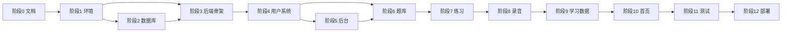

# 开发计划（development-plan.md）

> 本文把 PROJECT_SPEC §8 的 13 阶段细化为可执行任务清单，映射已锁定的 API/数据库/架构文档。
> 每个任务标注依赖、产出、验收标准。AI 协作时按任务粒度推进，一次一个任务。

---

## 0. 文档定位

- 回答："下一步做什么？做到什么程度算完成？"
- 不回答："怎么做。" → 对应 API/架构文档。
- 执行原则：**每个任务完成后 Git commit + 更新 AI_CONTEXT，再开始下一个。**

---

## 1. 总体阶段

| 阶段 | 名称 | 关键产出 | 状态 |
| --- | --- | --- | --- |
| 0 | 项目规划 | 全部设计文档 | ✅ 完成本文档即结束 |
| 1 | 开发环境 | Monorepo + Docker Compose 可启动 | ⏳ 待开始 |
| 2 | 数据库 | Alembic 迁移 + 种子数据 | ⏳ |
| 3 | 后端基础架构 | FastAPI 骨架 + 分层 + 配置 | ⏳ |
| 4 | 用户系统 | auth + users 模块 | ⏳ |
| 5 | 管理后台 | admin 模块 + admin-web | ⏳ |
| 6 | 题库系统 | questions 模块 + user-web 题库页 | ⏳ |
| 7 | 练习系统 | practice 模块（会话/attempt） | ⏳ |
| 8 | 录音系统 | recording 上传/下载/存储抽象 | ⏳ |
| 9 | 学习数据 | learning 模块 + ECharts | ⏳ |
| 10 | 首页 | home 模块 + 首页页 | ⏳ |
| 11 | 测试 | 后端 + 前端关键流程 | ⏳ |
| 12 | 部署 | Docker + Nginx + HTTPS | ⏳ |
| 13 | AI 增强 | 评分/转写（非 MVP，本文档不展开） | — |

> 阶段 13 不在 MVP 范围，本计划不细化。

---

## 2. 阶段 0：项目规划（已完成）

| 任务 | 产出 | 状态 |
| --- | --- | --- |
| 0.1 PROJECT_SPEC | PROJECT_SPEC.md v0.5 | ✅ |
| 0.2 AI_CONTEXT | AI_CONTEXT.md | ✅ |
| 0.3 数据库设计 | database-design.md v0.4 | ✅ |
| 0.4 系统架构 | system-architecture.md v0.1 | ✅ |
| 0.5 API 契约 | common/auth/users/questions/practice/learning/home/admin | ✅ |
| 0.6 用户流程 | user-flow.md | ✅ |
| 0.7 开发计划 | 本文档 | ✅ |

**阶段 0 验收**：所有设计文档锁定，AI_CONTEXT 反映完整状态，可进入代码阶段。

---

## 3. 阶段 1：开发环境

| 任务 | 产出 | 依赖 | 验收 |
| --- | --- | --- | --- |
| 1.1 初始化 Monorepo | 根 package.json + pnpm workspace | — | `pnpm install` 通过 |
| 1.2 初始化 user-web | Vite + Vue3 + TS + Router + Pinia | 1.1 | `pnpm dev` 启动 |
| 1.3 初始化 admin-web | 同上，独立 app | 1.1 | `pnpm dev` 启动 |
| 1.4 初始化 packages | ui/types/api-client/utils 骨架 | 1.1 | 可被 apps 引用 |
| 1.5 初始化 backend | FastAPI + pyproject.toml | — | `uvicorn` 启动返回 health |
| 1.6 Docker Compose | postgres + backend + user-web + admin-web | 1.2/1.3/1.5 | `docker compose up` 全绿 |
| 1.7 Git 分支策略 | main/develop + feature/* 约定 | — | README 记录 |

**阶段 1 验收**：`docker compose up` 后四个服务启动，前端能访问，后端 `/health` 返回 200。

---

## 4. 阶段 2：数据库

| 任务 | 产出 | 依赖 | 验收 |
| --- | --- | --- | --- |
| 2.1 Alembic 初始化 | migrations/ + env.py | 1.6 | `alembic upgrade head` 无报错 |
| 2.2 用户域迁移 | users/user_profiles/user_goals/roles | 2.1 | 4 表创建 + 索引 |
| 2.3 题库域迁移 | topics/tags/questions/question_tags | 2.2 | 4 表 + uq_favorites/Tags |
| 2.4 练习域迁移 | sessions/session_questions/attempts/recordings | 2.3 | 4 表 + uq_user_goals_active/uq_attempts |
| 2.5 行为域迁移 | favorites/study_records/activity_logs | 2.4 | 3 表 + 索引 |
| 2.6 种子数据 | Other 主题 + user/admin 角色 + 管理员账号 | 2.5 | seed 脚本幂等执行 |
| 2.7 触发器 | updated_at 自动更新 | 2.5 | UPDATE 后 updated_at 变化 |

**阶段 2 验收**：`alembic upgrade head` 建出全部 15 表 + 索引 + 触发器 + 种子，符合 database-design.md v0.4。

> 迁移顺序严格遵循 database-design.md §8 拓扑序 01→15。

---

## 5. 阶段 3：后端基础架构

| 任务 | 产出 | 依赖 | 验收 |
| --- | --- | --- | --- |
| 3.1 配置层 | core/config.py（env 读取） | 1.5 | 配置项可注入 |
| 3.2 数据库层 | core/database.py（session/engine） | 2.1 | 可查表 |
| 3.3 安全层 | core/security.py（JWT/bcrypt） | 3.1 | 可签发/校验 token |
| 3.4 异常层 | core/exceptions.py + 统一响应 | 3.1 | 422 改写为 common.md 格式 |
| 3.5 依赖注入 | get_current_user / require_admin | 3.3 | 受保护接口可鉴权 |
| 3.6 响应中间件 | {code,message,data} 包装 | 3.4 | 所有响应符合 common.md §2 |
| 3.7 模块骨架 | modules/{auth,users,...}/router | 3.6 | 路由可注册 |

**阶段 3 验收**：受保护接口返回统一响应，401/403/422 格式符合 common.md，按领域模块组织（system-architecture §3）。

---

## 6. 阶段 4：用户系统

| 任务 | 产出 | 依赖 | 文档 | 验收 |
| --- | --- | --- | --- | --- |
| 4.1 注册 API | POST /auth/register | 3.7 | auth.md §2 | 事务创建 user+profile+log |
| 4.2 登录 API | POST /auth/login | 4.1 | auth.md §3 | 3002 防枚举 |
| 4.3 退出 API | POST /auth/logout | 4.2 | auth.md §4 | 无状态返回 |
| 4.4 用户资料 | GET/PUT /users/me | 4.2 | users.md §2/§3 | timezone 校验 |
| 4.5 改密 API | PUT /users/me/password | 4.4 | users.md §4 | 3003 旧密码错 |
| 4.6 目标 API | GET/POST/PUT /users/me/goals | 4.4 | users.md §5/§6/§7 | ADR-014 active 唯一 |
| 4.7 user-web 登录页 | /login /register | 4.2 | — | 登录跳首页 |
| 4.8 user-web 我的页 | /profile | 4.4/4.5/4.6 | — | 资料/密码/目标可改 |

**阶段 4 验收**：用户可注册登录改资料设目标，JWT 鉴权全链路通。

---

## 7. 阶段 5：管理后台

| 任务 | 产出 | 依赖 | 文档 | 验收 |
| --- | --- | --- | --- | --- |
| 5.1 Dashboard | GET /admin/dashboard | 4.2 | admin.md §2 | 统计返回 |
| 5.2 用户管理 | GET /admin/users + PUT status | 4.2 | admin.md §3 | 8006/8007 防自锁 |
| 5.3 主题 CRUD | /admin/topics | 3.7 | admin.md §4 | 8001 Other 保护 |
| 5.4 标签 CRUD | /admin/tags | 3.7 | admin.md §5 | 8002 引用检查 |
| 5.5 题目 CRUD | /admin/questions | 5.3/5.4 | admin.md §6 | 不可物理删除 |
| 5.6 admin-web 骨架 | 路由 + 布局 + 登录 | 5.1 | — | admin 角色可进 |
| 5.7 admin-web 各页 | dashboard/users/topics/tags/questions | 5.1-5.5 | — | CRUD 可操作 |

**阶段 5 验收**：管理员可登录后台管理全部内容，Other 主题/题目物理删除受保护。

> **本地 Docker 验证待办（用户自行执行，沙箱不做预览）**：阶段 1.6 / 阶段 2 / 阶段 4 / 阶段 5 涉及实际运行（DB / API / 前端）的验收，沙箱无 Docker 与 PostgreSQL，待用户在本地 `docker compose up` 后统一验证。验收点：
> - 1.6 四服务全绿、前端可访问、后端 `/health` 200；
> - 2.1 `alembic upgrade head` 建出 15 表 + 索引 + 触发器 + 种子；
> - 4.x auth/users 全链路（注册/登录/资料/目标）；
> - 5.x admin 后台登录 + dashboard/users/topics/tags/questions CRUD + 启停。
> 沙箱侧只保证：单测全绿、type-check + build 通过、ruff 通过、迁移 offline SQL 语法正确。

---

## 8. 阶段 6：题库系统（用户端）

| 任务 | 产出 | 依赖 | 文档 | 验收 |
| --- | --- | --- | --- | --- |
| 6.1 题目列表 | GET /questions | 5.5 | questions.md §2 | 筛选/分页/排序 |
| 6.2 题目详情 | GET /questions/{id} | 6.1 | questions.md §3 | 4001/4002 分级 |
| 6.3 收藏 | POST/DELETE /favorite | 6.1 | questions.md §4/§5 | 幂等 |
| 6.4 user-web 题库页 | /questions /questions/:id | 6.1/6.2/6.3 | — | 筛选+收藏+跳练习 |

**阶段 6 验收**：用户可浏览题库筛选收藏，published 可见性正确。

---

## 9. 阶段 7：练习系统

| 任务 | 产出 | 依赖 | 文档 | 验收 |
| --- | --- | --- | --- | --- |
| 7.1 创建会话 | POST /practice/sessions | 6.1 | practice.md §2 | snapshot 生成 |
| 7.2 获取会话 | GET /practice/sessions/{id} | 7.1 | practice.md §3 | 续练可用 |
| 7.3 创建 attempt | POST /practice/attempts | 7.2 | practice.md §4 | session 自动激活 |
| 7.4 更新 attempt | PATCH /practice/attempts/{id} | 7.3 | practice.md §5 | submitted 不可直设 |
| 7.5 完成会话 | POST /complete | 7.4 | practice.md §8 | ADR-015 校验 |
| 7.6 user-web 练习页 | /practice/:id | 7.1-7.5 | — | 状态机 UI 正确 |

**阶段 7 验收**：会话全生命周期可走，状态机不可绕过（不含录音，下阶段）。

---

## 10. 阶段 8：录音系统

| 任务 | 产出 | 依赖 | 文档 | 验收 |
| --- | --- | --- | --- | --- |
| 8.1 存储抽象 | AudioStorage(local/s3) | 3.2 | sys-arch §7 | 可切换后端 |
| 8.2 元数据读取 | AudioMetadataReader | 8.1 | ADR-020 | duration 后端算 |
| 8.3 上传 API | POST /attempts/{id}/recording | 7.4/8.2 | practice.md §6 | 事务对齐 §5.1 |
| 8.4 下载 API | GET /attempts/{id}/recording | 8.3 | practice.md §7 | StreamingResponse |
| 8.5 study_records 同步 | 录音上传/会话完成事务内 upsert | 8.3/7.5 | ADR-022 | 统计实时更新 |
| 8.6 user-web 录音组件 | MediaRecorder 状态机 | 8.3 | sys-arch §5.4 | IDLE→...→UPLOADED |

**阶段 8 验收**：录音可上传下载，duration 后端计算，study_records 同步更新，ADR-015 跨表约束生效。

---

## 11. 阶段 9：学习数据

| 任务 | 产出 | 依赖 | 文档 | 验收 |
| --- | --- | --- | --- | --- |
| 9.1 概览 | GET /learning/overview | 8.5 | learning.md §2 | streak 正确 |
| 9.2 趋势 | daily/weekly/monthly | 9.1 | learning.md §3/4/5 | timezone 切日 |
| 9.3 分布 | topics/parts | 9.1 | learning.md §6/7 | 走事实表 |
| 9.4 重算 | POST /learning/recompute | 9.1 | learning.md §8 | admin 可调 |
| 9.5 user-web 数据页 | /learning + ECharts | 9.1-9.3 | — | 图表渲染 |

**阶段 9 验收**：统计数据正确，分布走事实表，重算可修复异常。

---

## 12. 阶段 10：首页

| 任务 | 产出 | 依赖 | 文档 | 验收 |
| --- | --- | --- | --- | --- |
| 10.1 首页 API | GET /home/overview | 9.1/7.2/6.1 | home.md §2 | 5 级推荐 |
| 10.2 user-web 首页 | / 首页 | 10.1 | — | 推荐含 reason |

**阶段 10 验收**：首页单接口聚合，推荐确定性可复现。

---

## 13. 阶段 11：测试

| 任务 | 产出 | 依赖 | 验收 |
| --- | --- | --- | --- |
| 11.1 后端 auth 测试 | pytest | 4 | 注册/登录/枚举防护 |
| 11.2 后端 practice 测试 | pytest | 8 | 状态机/ADR-015 |
| 11.3 后端 recording 测试 | pytest | 8 | 上传/duration/事务回滚 |
| 11.4 后端 learning 测试 | pytest | 9 | 统计/重算 |
| 11.5 前端登录流程 | Vitest/Playwright | 4.7 | 登录跳转 |
| 11.6 前端练习录音 | Playwright | 8.6 | 完整闭环 |
| 11.7 续练场景 | Playwright | 8.6 | 关闭重开恢复 |

**阶段 11 验收**：关键流程有自动化测试，续练场景通过。

---

## 14. 阶段 12：部署

| 任务 | 产出 | 依赖 | 验收 |
| --- | --- | --- | --- |
| 12.1 生产 Dockerfile | backend/user-web/admin-web | 11 | 镜像可构建 |
| 12.2 生产 compose | + nginx + postgres 持久化 | 12.1 | 一键起 |
| 12.3 Nginx 配置 | 反代 + 静态 + HTTPS | 12.2 | HTTPS 可访问 |
| 12.4 部署文档 | deploy.md | 12.3 | 可照文档部署 |
| 12.5 管理员初始化 | seed_admin 脚本 | 12.2 | 生产建管理员 |

**阶段 12 验收**：VPS 上一键部署，HTTPS 访问，管理员可登录录入题目，用户可完整练习。

---

## 15. 依赖关系图



---

## 16. Git 协作约定

```text
main          生产分支，仅接受 release PR
develop       集成分支
feature/*     功能分支，按任务粒度
```

命名示例：

```text
feature/auth-register
feature/practice-session
feature/recording-upload
feature/learning-overview
```

- 每个任务一个 feature 分支。
- 任务完成 → PR 到 develop → 自测 → merge。
- 阶段完成 → develop 合 main → 打 tag `v0.x.0-stageN`。

---

## 17. AI 协作任务粒度原则

> 一次只给 AI 一个任务，对应本计划的一行。

- 给 AI 任务时附上：任务编号 + 依赖文档路径 + 验收标准。
- 禁止："帮我实现练习系统"（跨多任务）。
- 推荐："实现任务 7.1 创建会话 API，遵循 practice.md §2，验收：snapshot 生成、5004 题数不足"。

---

## 变更记录

| 版本 | 日期 | 变更 |
| --- | --- | --- |
| v0.1 | 2026-07-23 | 初始创建：13 阶段细化任务清单 + 依赖图 + Git 约定 + AI 任务粒度原则；阶段 0 全部完成 |
