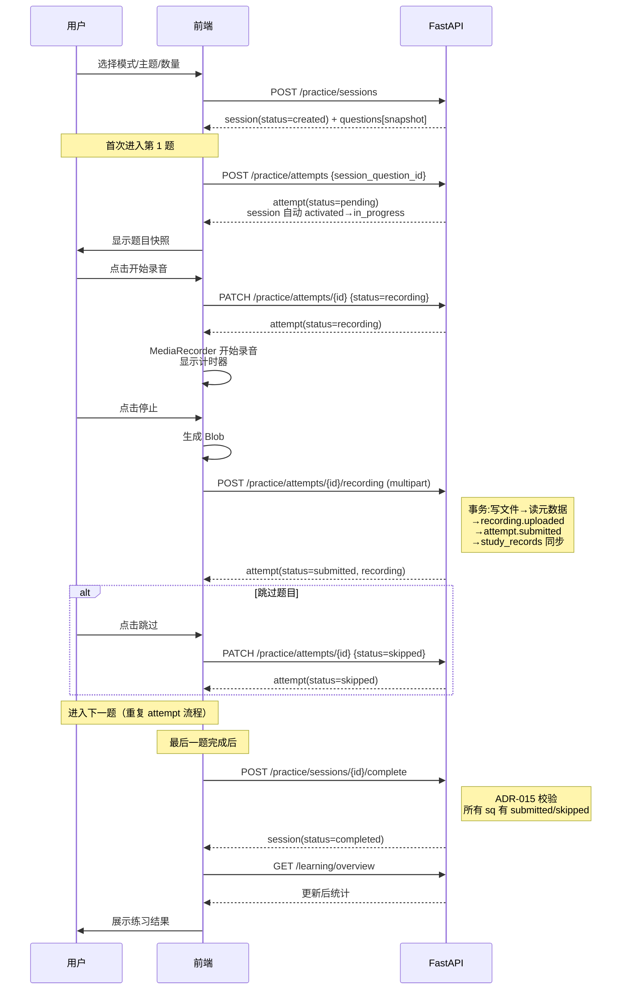
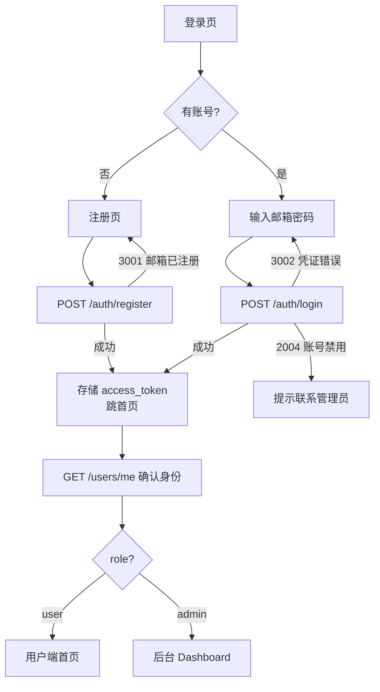
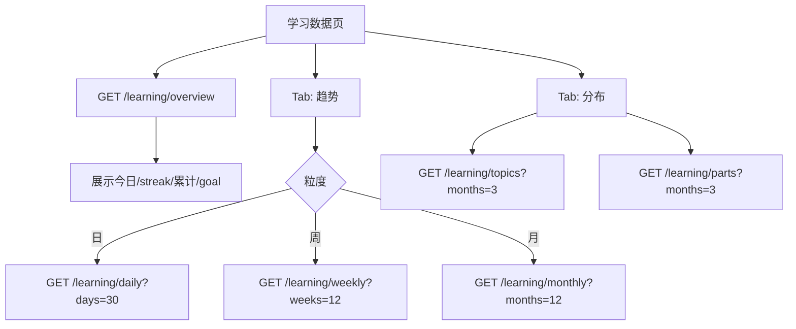
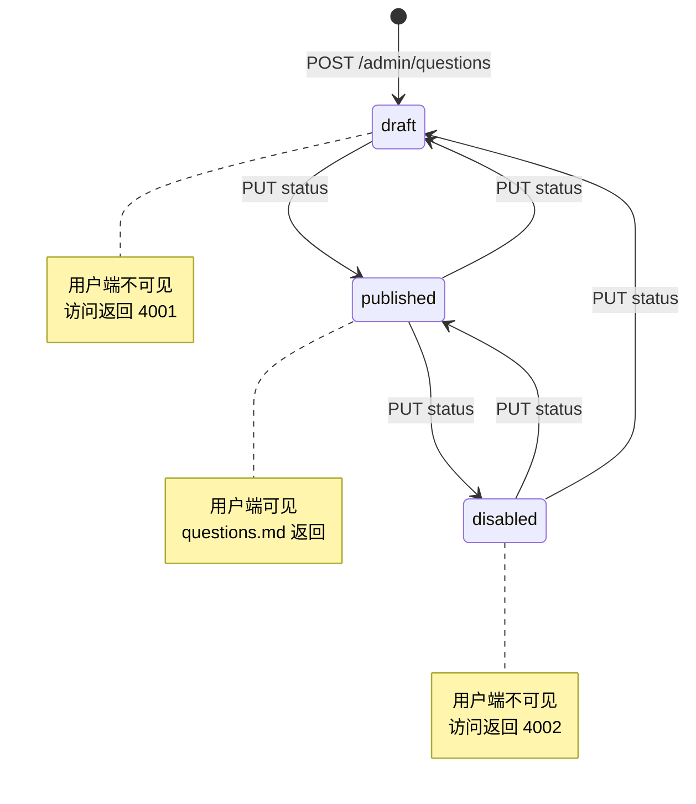

# 用户流程（user-flow.md）

> 本文用 Mermaid 描述核心用户流程，引用已锁定的 API 路径与状态机。
> 不重新定义接口或状态机，仅可视化 [system-architecture.md](file:///workspace/docs/architecture/system-architecture.md) §5 与各 [API 文档](file:///workspace/docs/api/)。

---

## 1. 文档定位

- 回答："用户/管理员从进入应用到完成核心目标，经过哪些页面与接口？"
- 不回答："接口字段长什么样。" → API 文档。
- 不回答："状态机有哪些状态。" → system-architecture.md §5。

---

## 2. 用户端整体流程

```mermaid
flowchart TD
    A[访问应用] --> B{已登录?}
    B -- 否 --> C[登录/注册页]
    C --> D[POST /auth/login]
    D -- 成功 --> E[首页]
    D -- 3001/3002 --> C
    B -- 是 --> E

    E[首页<br/>GET /home/overview] --> F{用户选择}
    F -- 继续练习 --> G[练习页<br/>GET /practice/sessions/{id}]
    F -- 浏览题库 --> H[题库列表<br/>GET /questions]
    F -- 查看数据 --> I[学习数据<br/>GET /learning/overview]
    F -- 个人中心 --> J[我的<br/>GET /users/me]

    H --> K[题目详情<br/>GET /questions/{id}]
    K -- 开始练习 --> L[创建会话<br/>POST /practice/sessions]
    K -- 收藏 --> M[POST/DELETE /questions/{id}/favorite]

    L --> G
    G --> N[练习流程<br/>见 §3]
    N --> I
```

---

## 3. 练习录音核心流程



---

## 4. 续练流程（断线恢复）

```mermaid
flowchart TD
    A[用户重开应用] --> B[GET /home/overview]
    B --> C{recent_practice.has_unfinished?}
    C -- 是 --> D[显示"继续练习"卡片]
    D --> E[用户点击]
    E --> F[GET /practice/sessions/{id}]
    F --> G{遍历 questions.attempts}
    G --> H[定位最后未完成 sq]
    H --> I[恢复 UI 状态:<br/>pending/recording/submitted]
    I --> J[继续练习流程 §3]
    C -- 否 --> K[正常浏览/新练习]
```

> 续练依赖 session.status='in_progress' 与 attempts 状态持久化（practice.md §3.5）。

---

## 5. 注册登录流程



---

## 6. 学习数据流程



---

## 7. 后台管理流程

```mermaid
flowchart TD
    A[管理员登录<br/>POST /auth/login] --> B[role=admin?]
    B -- 否 --> C[2003 拒绝]
    B -- 是 --> D[后台 Dashboard<br/>GET /admin/dashboard]

    D --> E{管理模块}
    E -- 用户 --> F[GET /admin/users]
    F --> G[禁用/启用<br/>PUT /admin/users/{id}/status]

    E -- 题目 --> H[GET /admin/questions]
    H --> I[创建/编辑/状态切换]

    E -- 主题 --> J[GET /admin/topics]
    J --> K[CRUD<br/>Other 主题受 8001 保护]

    E -- 标签 --> L[GET /admin/tags]
    L --> M[CRUD<br/>引用检查 8002]

    E -- 重算 --> N[POST /learning/recompute]
```

---

## 8. 题目状态生命周期（管理员视角）



> 题目不可物理删除（ADR-010），无 DELETE 接口。

---

## 9. 关键流程约束清单

| 流程 | 约束 | 来源 |
| --- | --- | --- |
| 录音上传 | submitted 必须在 recording.uploaded 之后 | ADR-015 / practice.md §6.4 |
| 会话完成 | 所有 sq 有 submitted/skipped attempt | ADR-015 / practice.md §8.4 |
| duration 统计 | 后端读元数据，不信前端 | ADR-020 |
| study_records | 录音上传/会话完成事务同步更新 | ADR-022 |
| 推荐生成 | 5 级短路，确定性无 AI | ADR-028 / home.md §2.5 |
| 题目删除 | 不允许物理删除，仅 disabled | ADR-010 |
| Other 主题 | 不可删/停用/重命名 | PROJECT_SPEC §12.3 |
| 时区切日 | 按 user_profiles.timezone | ADR-018 |
| 历史快照 | session_questions.snapshot 不可变 | ADR-016 |

---

## 变更记录

| 版本 | 日期 | 变更 |
| --- | --- | --- |
| v0.1 | 2026-07-23 | 初始创建：用户端整体/练习录音/续练/登录/学习数据/后台 6 大流程 + 题目状态机 + 约束清单 |
